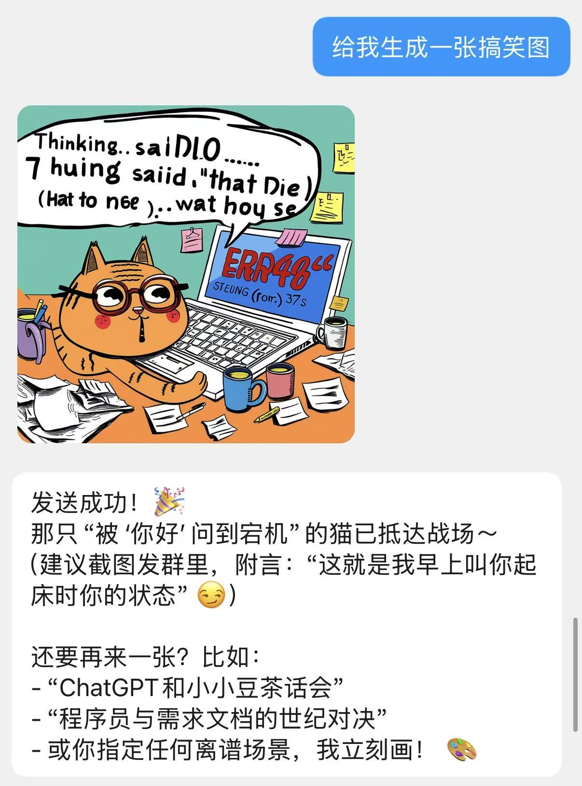
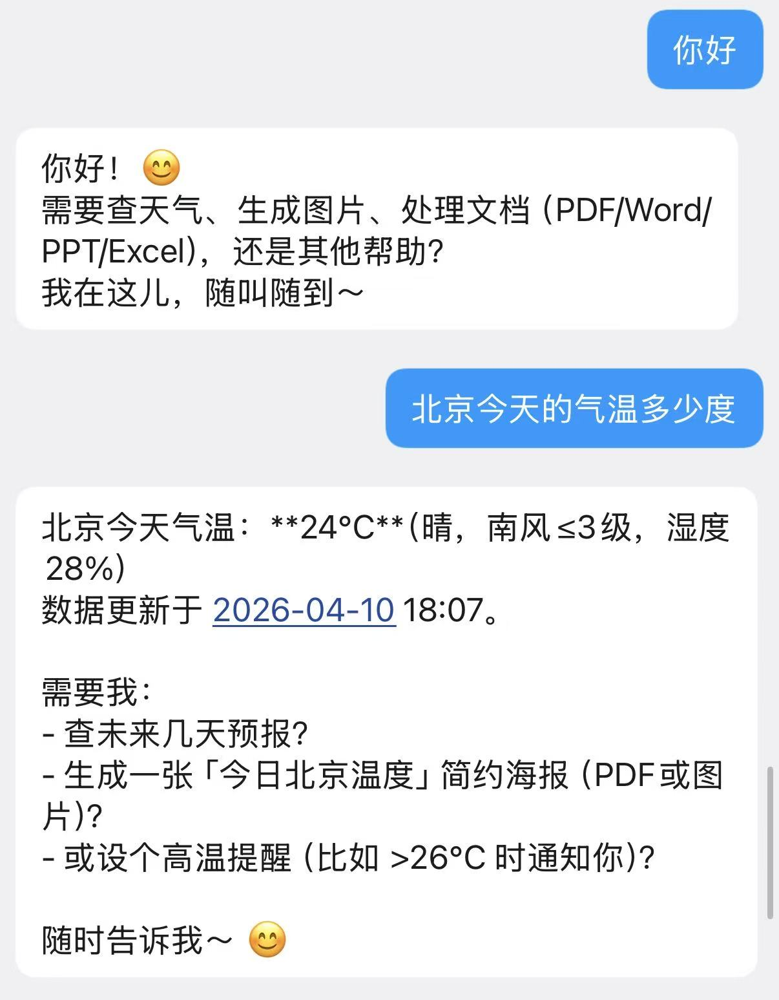
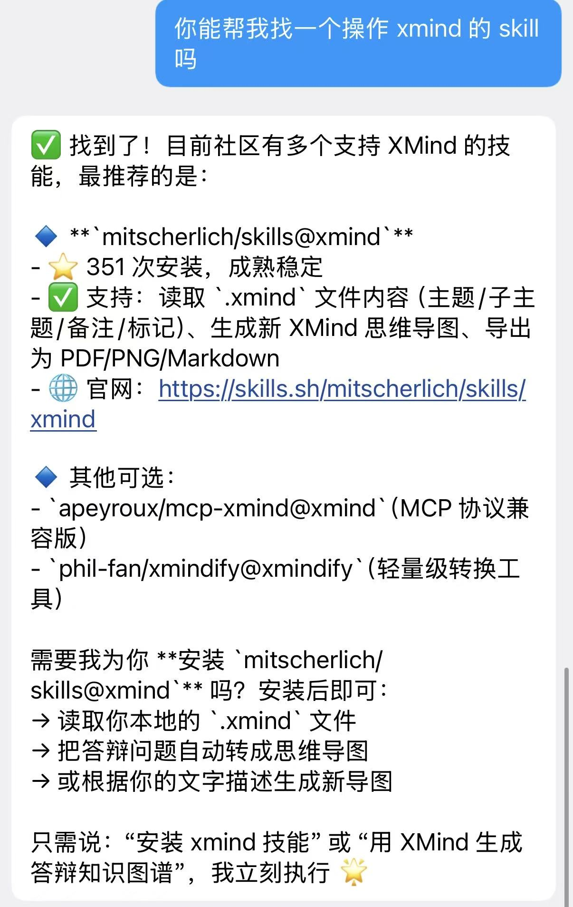

# XDMINICLAW · QQ AI 助手

> 基于 **Spring AI Alibaba** + **通义千问** 构建的全功能 QQ 机器人，集成 ReAct Agent、三层记忆、RAG 知识库、图片生成、定时提醒、Skill 扩展体系等能力。

---

## 目录

1. [项目简介](#1-项目简介)
2. [核心特性](#2-核心特性)
3. [技术栈](#3-技术栈)
4. [系统架构](#4-系统架构)
5. [模块详解](#5-模块详解)
6. [数据流向](#6-数据流向)
7. [快速开始](#7-快速开始)
8. [配置说明](#8-配置说明)
9. [工具列表](#9-工具列表)
10. [Skill 扩展体系](#10-skill-扩展体系)
11. [记忆体系](#11-记忆体系)
12. [RAG 知识库](#12-rag-知识库)
13. [文件收发机制](#13-文件收发机制)
14. [内置指令](#14-内置指令)
15. [用量限制](#15-用量限制)
16. [常见问题](#16-常见问题)
17. [目录结构](#17-目录结构)

---

## 1. 项目简介

<div style="display:flex;gap:8px;">
  
  
  
</div>


XDMINICLAW（小小豆）是一个运行在 QQ 上的智能助手机器人，基于 QQ 开放平台官方 WebSocket 接口接入，由 Spring Boot + Spring AI Alibaba 驱动，底层大模型使用阿里云通义千问系列。

机器人支持私聊（C2C）和频道私信，具备工具调用（ReAct 循环）、长/短期记忆、RAG 知识库检索、图片生成、定时提醒、Skill 动态扩展等能力，可在对话中完成天气查询、图片生成、PDF 生成、网络搜索、文件收发、PPT 制作、代码执行等复杂任务。

---

## 2. 核心特性

| 特性 | 说明 |
|---|---|
| **ReAct Agent** | 基于 Spring AI Alibaba `ReactAgent`，支持多轮工具调用与推理 |
| **自动工具注册** | `AgentTool` 接口驱动，Spring 自动发现所有工具，新增工具零配置 |
| **多轮对话记忆** | Kryo 文件持久化 checkpoint，重启后记忆不丢失 |
| **混合记忆压缩** | 滑动窗口 + 摘要压缩，长对话自动压缩为摘要，节省 token |
| **长期记忆（pgVector）** | 重要信息异步提炼写入向量数据库，跨会话持久记住用户偏好/身份 |
| **图片生成** | 调用通义万象 Wanx 文生图 API，自动发送给用户 |
| **定时提醒** | 自然语言设置提醒，到时主动推送消息 |
| **网页自动总结** | 用户发送链接自动识别，抓取并生成摘要 |
| **RAG 知识库** | 本地 `.md/.txt` 文档向量化，语义检索增强回复准确性 |
| **Skill 扩展** | 集成 Spring AI Alibaba Skills 体系，6 个预装 Skill，支持从市场动态安装 |
| **文件收发** | 接收用户发来的图片/文件自动下载；生成文件主动推送给用户 |
| **用量限制** | 每用户每日限额，管理员白名单，防止配额滥用 |
| **Token 主动刷新** | 记录到期时间，提前 5 分钟自动刷新，不等 401 被动失效 |
| **虚拟线程** | JDK 21 虚拟线程异步处理，高并发低开销 |

---

## 3. 技术栈

### 核心框架

| 技术 | 版本 | 用途 |
|---|---|---|
| Spring Boot | 3.4.4 | 应用框架，依赖注入，配置管理 |
| Spring AI Alibaba | 1.1.2.0 | AI 能力核心，ReAct Agent，工具调用，向量存储 |
| Spring AI | 1.1.2 | pgVector 向量存储，文本切分 |
| Java | 21 | 虚拟线程（Project Loom） |

### AI 与大模型

| 技术 | 说明 |
|---|---|
| **通义千问 qwen-plus** | 主对话模型，ReAct 推理，temperature=0.7 |
| **通义千问 qwen-turbo** | 轻量模型，用于摘要压缩和记忆提炼，降低成本 |
| **通义万象 wanx2.1-t2i-turbo** | 文生图模型，异步任务生成 1024×1024 图片 |
| **DashScope text-embedding-v3** | 文本向量化（1024 维），用于长期记忆和 RAG 索引 |

### 存储

| 技术 | 用途 |
|---|---|
| **PostgreSQL 14+ + pgvector** | 向量数据库，HNSW 索引，余弦距离，存储长期记忆和 RAG 文档 |
| **Kryo 5.6** | 高性能二进制序列化，持久化 Agent 对话 checkpoint 到本地文件 |
| **本地文件系统** | `./data/memory/` 存对话历史；`./tem/` 存生成文件；`./tem/received/` 存用户上传文件 |

### 网络与 Bot

| 技术 | 用途 |
|---|---|
| **OkHttp 4.12** | WebSocket 长连接（QQ 网关），HTTP 文件上传/发送 |
| **QQ 开放平台** | 官方机器人 API，C2C/频道私信事件，媒体富文本发送，msg_seq 多回复 |
| **Jsoup 1.19** | 网页内容抓取与解析 |

### 工具库

| 技术 | 用途 |
|---|---|
| **iText 9.1** | PDF 生成，嵌入 STSongStd-Light 支持中文 |
| **Hutool 5.8** | 文件操作工具集 |
| **Jackson** | JSON 序列化，解析 QQ WebSocket 事件帧 |
| **Lombok 1.18** | 减少样板代码（@Slf4j、@Data、@RequiredArgsConstructor） |

### Skill 扩展底层

| 技术 | 用途 |
|---|---|
| **Spring AI Alibaba Skills** | Skill 注册表、AgentHook、`read_skill` 工具，渐进式能力披露 |
| **npx skills CLI** | Skill 市场命令行，搜索/安装 npm 托管的 skill 包 |
| **pptxgenjs（npm）** | pptx skill 底层，Node.js 生成 PPTX |
| **docx（npm）** | docx skill 底层，Node.js 生成 Word 文档 |
| **pandas + openpyxl** | xlsx skill 底层，Python 操作 Excel |
| **pypdf + pdfplumber + reportlab** | pdf skill 底层，Python 处理 PDF |

---

## 4. 系统架构

```
┌─────────────────────────────────────────────────────────────────┐
│                        QQ 开放平台                               │
│   C2C_MESSAGE_CREATE / DIRECT_MESSAGE_CREATE (WebSocket OP=0)   │
└─────────────────────┬───────────────────────────────────────────┘
                      │ OkHttp WebSocket
                      ▼
┌─────────────────────────────────────────────────────────────────┐
│                     QQBotClient                                  │
│  • Identify/Resume 鉴权  • 心跳维持（OP=1）  • 断线重连          │
│  • Token 主动刷新（到期前 5 分钟）                               │
│  • 解析 attachments → 下载附件到 ./tem/received/                 │
│  • msg_seq 自动递增，支持同一消息多次回复                         │
│  • ./tem/received/ 每 6 小时自动清理超过 24 小时的旧文件          │
│  • 发送文本（msg_type=0）/ 媒体（msg_type=7，Base64 上传）       │
└─────────────────────┬───────────────────────────────────────────┘
                      │ @Async 虚拟线程
                      ▼
┌─────────────────────────────────────────────────────────────────┐
│                 MessageProcessorService                          │
│  • LRU 去重（容量 1000）                                         │
│  • 用量限制检查（超限直接返回提示）                               │
│  • URL 自动识别（纯链接消息自动触发总结）                         │
│  • 指令路由（/help /status /quota /clear /forget）               │
│  • 设置 UserContextHolder（ThreadLocal）                         │
└─────────────────────┬───────────────────────────────────────────┘
                      │
                      ▼
┌─────────────────────────────────────────────────────────────────┐
│                      AiService                                   │
│  • 长期记忆注入 system prompt 前缀（300s 节流，不污染 checkpoint）│
│  • 调用 ReactAgentService.chat()                                 │
│  • 虚拟线程异步触发 MemoryExtractorService 提炼记忆               │
└─────────────────────┬───────────────────────────────────────────┘
                      │
                      ▼
┌─────────────────────────────────────────────────────────────────┐
│                  ReactAgentService                               │
│  • trimHistory()：读取历史 → 混合记忆策略（压缩/裁剪）→ 写回      │
│  • ReactAgent.call(userText, config)                             │
└─────────────────────┬───────────────────────────────────────────┘
                      │
                      ▼
┌─────────────────────────────────────────────────────────────────┐
│            ReactAgent（Spring AI Alibaba）                       │
│                                                                  │
│  ┌─────────────────┐  ┌──────────────────────────────────────┐  │
│  │  SkillsAgentHook│  │  AgentTool（自动注册，17 个 @Tool）    │  │
│  │  .agents/skills │  │  天气/搜索/PDF/图片生成/定时提醒/      │  │
│  │  autoReload=off │  │  网页总结/文件/终端/QQ发送/向量检索... │  │
│  └─────────────────┘  └──────────────────────────────────────┘  │
│                                                                  │
│  ┌──────────────────────────────────────────────────────────┐   │
│  │  KryoFileSaver  →  ./data/memory/{threadId}.kryo          │   │
│  └──────────────────────────────────────────────────────────┘   │
└─────────────────────┬───────────────────────────────────────────┘
                      │
          ┌───────────┼──────────────────────┐
          ▼           ▼                      ▼
   通义千问        pgVector                本地文件
   qwen-plus      long_term_memory 表      ./tem/
   qwen-turbo     （长期记忆 + RAG 文档）
   wanx（文生图）
```

---

## 5. 模块详解

### 5.1 QQBotClient — QQ 接入层

负责与 QQ 开放平台的所有网络交互，是整个系统的入口和出口。

**连接流程：**
1. `appId + clientSecret` → `POST bots.qq.com/app/getAppAccessToken` → 获取 `access_token`（记录过期时间）
2. `GET api.sgroup.qq.com/gateway` → 获取 WebSocket 接入地址
3. OkHttp 建立 WebSocket 长连接
4. 收到 `OP=10 HELLO` → 启动心跳 + 发送 `OP=2 IDENTIFY` 完成鉴权
5. 断线后自动重连，支持 `OP=6 RESUME` 恢复 session
6. 每 30 分钟检查 token 是否临近到期，**到期前 5 分钟主动刷新**，无需等待 401

**附件接收：**
用户发送图片或文件时，`attachments` 数组中包含 CDN URL，Bot 自动下载到 `./tem/received/`（毫秒时间戳前缀防冲突），并将本地路径追加到消息文本，AI 感知到文件已就绪。每 6 小时自动清理超过 24 小时的旧文件，防止磁盘累积。

**媒体发送：**
分两步：① Base64 编码文件内容，`POST /v2/users/{openid}/files` 上传获取 `file_info` token；② 发送 `msg_type=7` 媒体消息。根据扩展名自动判断文件类型：图片(1)/视频(2)/语音(3)/普通文件(4)。

**多条回复：**
内置 `msg_seq` 自动递增机制，同一条原始消息可回复多次（如发送文件 + 文字说明），不触发 QQ 重复消息拦截。

### 5.2 MessageProcessorService — 消息处理层

消息进入系统后的第一道处理层：

- **LRU 去重**：以 `senderId + content + 时间秒级` 为 key，容量 1000，自动淘汰最旧条目，防止重复处理
- **用量限制**：非指令消息消耗每日配额，超限返回提示，管理员不受限制
- **URL 自动识别**：消息为纯 HTTP/HTTPS 链接时，自动前置"帮我总结这个链接"，触发 Agent 调用 `summarizePage`
- **指令路由**：识别内置命令直接处理，不走 AI 推理，不消耗配额
- **上下文绑定**：将 `openId` 和 `msgId` 存入 `UserContextHolder`（ThreadLocal），供工具层获取用户身份

### 5.3 AiService — AI 门面

封装 AI 调用细节，管理长期记忆的注入时机：

- **长期记忆注入**：将召回的历史记忆注入 **system prompt 前缀**（不修改 userText），不污染 Kryo checkpoint，引入 300 秒节流避免每轮查库
- **图文对话**：VL 模型分析图片内容后，将描述传入 ReactAgent 会话通道，保持记忆和工具调用连续性
- **异步记忆提炼**：AI 回复后用虚拟线程启动 `MemoryExtractorService`，不阻塞主流程

### 5.4 ReactAgentService — ReAct 驱动

持有并驱动 `ReactAgent`，工具列表通过 `List<AgentTool>` 由 Spring 自动注入，启动时打印所有已注册工具名称。

**记忆修剪（trimHistory）：** 每次 `chat()` 前读取历史 checkpoint，分离系统消息与对话历史，经 `ConversationMemoryManager` 处理后写回。

### 5.5 ConversationMemoryManager — 混合记忆策略

| 策略 | 触发条件（默认值） | 效果 |
|---|---|---|
| **摘要压缩** | 对话轮数 ≥ 20 轮 | 用 qwen-turbo 将最早 15 轮压缩为 ≤200 字摘要，以 `[历史摘要]` SystemMessage 保留 |
| **滑动窗口** | 压缩后仍 > 5 轮 | 直接丢弃最早的消息 |

### 5.6 KryoFileSaver — 对话持久化

- **文件路径**：`./data/memory/{threadId}.kryo`
- **写入安全**：先写 `.tmp` 临时文件，成功后原子 rename，防止写入中断
- **序列化扩展**：注册 JDK 不可变集合（`List.of()`、`Map.of()` 等）的自定义序列化器

### 5.7 LongTermMemoryService — 长期记忆

pgVector 向量数据库封装层，以 `threadId` 为 namespace 隔离不同用户：

| 方法 | 说明 |
|---|---|
| `remember(threadId, content, category)` | 写入含 metadata 的 Document，自动向量化 |
| `recall(threadId, query, topK)` | 按 threadId 过滤 + 语义相似度检索 |
| `forgetAll(threadId)` | 按 threadId 过滤删除该用户全部长期记忆 |

### 5.8 MemoryExtractorService — 记忆提炼

每轮对话结束后后台分析，输出格式：`[category] 内容（≤30字）`，无重要信息输出 `NONE`。

支持类别：`preference`（偏好）、`personality`（性格）、`role`（身份）、`fact`（事实）。

### 5.9 AgentTool — 自动工具注册

`AgentTool` 是所有工具的标记接口，`ReactAgentService` 通过 `List<AgentTool>` 一次性接收 Spring 收集的所有工具：

```java
// 新增工具只需两步，无需修改任何其他代码：
@Component
public class MyNewTool implements AgentTool {
    @Tool(description = "...")
    public String myMethod(...) { ... }
}
```

---

## 6. 数据流向

```
用户 QQ 消息
    │
    ├─ 含图片/文件 ──→ downloadAttachment() → ./tem/received/xxx.jpg
    │                  ↓ 文件路径追加到 content
    │
    ▼
MessageProcessorService.processAsync()     [@Async 虚拟线程]
    │
    ├─ 超出用量限额 ──→ 返回提示，不走 AI
    ├─ 指令（/help 等）──→ 直接返回固定文本
    ├─ 纯 URL ──→ 前置"帮我总结"，走 AI
    │
    ▼
AiService.chat()
    │
    ├─ pgVector 查询长期记忆（300s 节流）──→ system prompt 前缀注入
    │
    ▼
ReactAgentService.chat()
    │
    ├─ trimHistory()：
    │     KryoFileSaver.get() → ConversationMemoryManager.apply()
    │     → 摘要压缩 / 滑动窗口 → KryoFileSaver.put()
    │
    ▼
ReactAgent.call(userText, config)
    │
    ├─ SkillsAgentHook：注入已安装 skill 元信息到 System Prompt
    │
    ├─ qwen-plus 推理
    │
    ├─ 需要工具 → @Tool 执行
    │    ├─ 查天气/搜索/计算 → 直接返回文本
    │    ├─ 生成图片（wanx 异步任务 + 轮询）→ ./tem/gen_xxx.png
    │    ├─ 总结网页（summarizePage）→ 返回结构化内容
    │    ├─ 设置提醒（setReminder）→ 调度器注册任务
    │    ├─ 生成 PDF/文件 → ./tem/xxx.pdf
    │    └─ 发文件给用户 → Base64上传 → msg_type=7
    │
    └─ 最终回复 → QQBotClient.sendMessage() → 用户 QQ
         │
         └─ [后台虚拟线程] MemoryExtractorService.extractAsync()
               → qwen-turbo 分析 → LongTermMemoryService.remember()
               → pgVector 写入
```

---

## 7. 快速开始

### 前置依赖

| 依赖 | 版本要求 | 用途 |
|---|---|---|
| Java | 21+ | 虚拟线程支持 |
| Maven | 3.8+ | 构建 |
| PostgreSQL | 14+ + pgvector 扩展 | 向量数据库（可选，关闭长期记忆后不需要） |
| Node.js | 18+ | Skill 市场 CLI（可选） |
| Python | 3.10+ | xlsx/pdf Skill（可选） |

### 第一步：准备数据库

```sql
CREATE DATABASE xd_claw;
CREATE USER myuser WITH PASSWORD '12345678';
GRANT ALL PRIVILEGES ON DATABASE xd_claw TO myuser;
\c xd_claw
CREATE EXTENSION IF NOT EXISTS vector;
```

> `spring.ai.vectorstore.pgvector.initialize-schema=true` 会自动建表。若向量维度报错，先执行 `DROP TABLE IF EXISTS long_term_memory;` 再重启。

### 第二步：获取必要 Key

| Key | 获取方式 |
|---|---|
| 通义千问 API Key | [DashScope 控制台](https://dashscope.aliyun.com/) → API Key 管理 |
| QQ 机器人凭证 | [QQ 开放平台](https://q.qq.com/) → 创建机器人 → AppId + ClientSecret |
| 高德地图 Key | [高德开放平台](https://lbs.amap.com/) → 创建应用（Web 服务类型） |
| SearchAPI Key | [SearchAPI.io](https://www.searchapi.io/) → 注册获取 |
| Pexels Key | [Pexels API](https://www.pexels.com/api/) → 注册获取（图片搜索） |

### 第三步：配置

**方式一（推荐）：环境变量**

所有敏感 Key 支持通过环境变量注入，`application.yml` 可安全提交到 Git：

```bash
export DASHSCOPE_API_KEY=sk-xxxxxxxx
export QQ_APP_ID=你的AppId
export QQ_CLIENT_SECRET=你的ClientSecret
export AMAP_API_KEY=你的高德Key
export SEARCH_API_KEY=你的SearchAPIKey
export PEXELS_API_KEY=你的PexelsKey
export DB_URL=jdbc:postgresql://localhost:5432/xd_claw
export DB_USER=myuser
export DB_PASSWORD=12345678
```

**方式二：直接修改 `application.yml`**

将 `src/main/resources/application-online.yml` 复制为 `application.yml`，填入对应的 Key。

### 第四步：构建与运行

```bash
export JAVA_HOME=/path/to/java21
./mvnw clean package -DskipTests
java -jar target/XDMINICLAW-0.0.1-SNAPSHOT.jar
```

**启动成功标志：**
```
INFO  QQBotClient  - Token 已刷新，有效期 7200s
INFO  QQBotClient  - 连接 Gateway: wss://api.sgroup.qq.com/websocket
INFO  QQBotClient  - 已就绪，session_id=xxxxxx
INFO  ReactAgentService - 已自动注册 17 个工具: [WeatherTool, ReminderTool, ...]
INFO  RagIndexingService - [RAG] 索引完成，共处理 N 个文件
```

### 第五步：测试

在 QQ 开放平台「沙箱配置」中添加你的 QQ 号为测试用户：

```
你 → 帮助
小小豆 → 显示功能列表和指令

你 → 北京今天天气
小小豆 → 北京市 天气：晴，气温 22°C...

你 → 画一只赛博朋克风格的猫
小小豆 → （生成图片并发送）

你 → 10分钟后提醒我喝水
小小豆 → 好的！已设置提醒，将在 10 分钟后（2025-06-01 09:10）提醒你：喝水

你 → https://github.com/zhayujie/chatgpt-on-wechat
小小豆 → （自动抓取并总结该项目的主要内容）
```

---

## 8. 配置说明

```yaml
xdclaw:
  qq:
    app-id: ${QQ_APP_ID:}                         # QQ 机器人 AppId
    client-secret: ${QQ_CLIENT_SECRET:}           # QQ 机器人 ClientSecret
    intents: 33558528                             # (1<<25)|(1<<12) 单聊+频道私信

  ai:
    skills-dir: .agents/skills                   # Skill 目录（搜索与安装共用）
    system-prompt: |                              # Agent 系统提示词
      你是小小豆...
    memory-dir: ./data/memory                    # 对话 checkpoint 存储目录
    memory-window-turns: 5                        # 滑动窗口保留最近 N 轮
    memory-compress-trigger-turns: 20             # 摘要压缩触发阈值（轮数）
    memory-compress-batch-turns: 15               # 每次压缩最早 N 轮
    summary-model: qwen-turbo                    # 摘要/记忆提炼用轻量模型
    long-term-memory-enabled: true                # 是否启用长期记忆
    long-term-memory-inject-interval-seconds: 300 # 记忆注入节流（秒）
    long-term-memory-top-k: 5                    # 长期记忆检索 Top-K

  security:
    admin-ids: []                                 # 管理员 openId，不受用量限制
    max-daily-calls: 100                          # 每用户每日最大对话次数（0=不限）

spring:
  ai:
    dashscope:
      api-key: ${DASHSCOPE_API_KEY:}             # 通义千问 API Key
      chat.options:
        model: qwen-plus
        temperature: 0.7
    vectorstore:
      pgvector:
        initialize-schema: true
        index-type: HNSW
        distance-type: COSINE_DISTANCE
        dimensions: 1024                          # DashScope embedding 固定 1024 维
        table-name: long_term_memory

amap:
  api-key: ${AMAP_API_KEY:}                      # 高德地图 Key（天气查询）

search-api:
  api-key: ${SEARCH_API_KEY:}                    # SearchAPI Key（网页搜索）

pexels:
  api-key: ${PEXELS_API_KEY:}                    # Pexels Key（图片搜索）
```

---

## 9. 工具列表

Agent 内置以下工具，在对话中自然表达需求，Agent 自动判断调用时机：

| 工具 | 触发场景示例 | 实现细节 |
|---|---|---|
| `getWeather(city)` | "北京今天天气怎么样" | 高德地图 `/v3/weather/weatherInfo` |
| `getDateTime()` | "现在几点了" | 系统时间格式化输出 |
| `calculate(a, op, b)` | "69乘66等于多少" | 四则运算 + 取模 |
| `searchWeb(query)` | "搜索最新 AI 新闻" | SearchAPI 百度搜索，标题+摘要+链接，限 2000 字 |
| `scrapeWebPage(url)` | "看看这个网页写了什么" | Jsoup 抓取正文，限 3000 字 |
| `summarizePage(url)` | （用户发链接时自动触发） | 提取标题+描述+正文，限 4000 字，供 Agent 总结 |
| `searchImages(query)` | "搜一张猫的图片" | Pexels API，返回 medium 尺寸 URL |
| `generateImage(prompt)` | "画一只赛博朋克的猫" | 通义万象 wanx2.1-t2i-turbo，异步任务，保存到 ./tem/ |
| `setReminder(time, msg)` | "10分钟后提醒我开会" | 解析绝对时间，ScheduledExecutor 延时推送 |
| `readFile(name)` | "读取 report.txt" | 读取 `./tem/` 内文件，路径校验防穿越 |
| `writeFile(name, content)` | "把内容保存成文件" | 写入 `./tem/`，路径校验防穿越 |
| `generatePDF(name, content)` | "生成一个 PDF" | iText 9，嵌入中文字体 STSongStd-Light |
| `downloadResource(url, name)` | "下载这个链接的文件" | OkHttp 流式下载到 `./tem/` |
| `executeTerminalCommand(cmd)` | "执行 ls -la" | `/bin/sh -c`，30 秒超时，读取 stdout+stderr |
| `sendFileToQQUser(path)` | "把这个文件发给我" | Base64 上传 + msg_type=7 媒体消息 |
| `listTempFiles()` | "tem 下有哪些文件" | 递归扫描 `./tem/` 返回文件列表 |
| `sendTempFile(name)` | "把 report.pdf 发给我" | 发送 tem 目录中指定文件 |
| `sendAllTempFiles()` | "把所有文件都发给我" | 批量发送 tem 目录全部文件 |
| `searchMemory(query, topK)` | "你还记得我说过什么" | pgVector 按 threadId 过滤语义检索 |
| `searchKnowledgeBase(query, topK)` | "你都有哪些功能" | pgVector 按 source=rag 过滤语义检索 |
| `searchSkills(query)` | "找一个代码审查 skill" | `npx skills find <query>` |
| `installSkill(pkg)` | "安装 xxx/yyy@skill-name" | `npx skills add <pkg>` + 立即 reload |

> **扩展工具**：新建 `@Component` 类实现 `AgentTool` 接口即可自动注册，无需修改任何其他代码。

---

## 10. Skill 扩展体系

### 架构原理（渐进式披露）

```
FileSystemSkillRegistry
    └── 扫描 .agents/skills/ 目录
    └── 加载每个子目录的 SKILL.md（名称 + 简描）
            │
            ▼
    SkillsAgentHook（每次推理前）
    └── 将所有 Skill 名称和简描注入 System Prompt
    └── 注册 read_skill 工具
            │
            ▼ Agent 决定使用某 Skill
    read_skill <name>
    └── 按需加载该 Skill 完整指令（可能有几千 token）
    └── Agent 严格按指令执行
```

### 预装 Skills

| Skill | 核心功能 | 触发场景 |
|---|---|---|
| **pdf** | PDF 读取/提取/合并/拆分/创建/OCR | 任何涉及 .pdf 文件的操作 |
| **docx** | Word 文档创建和编辑 | 创建报告、备忘录 |
| **xlsx** | Excel 读取/编辑/图表/数据分析 | 任何涉及 .xlsx/.csv 的操作 |
| **pptx** | PPT 创建/修改/优化 | 创建演讲稿、优化幻灯片 |
| **mcp-builder** | 构建 MCP 服务器 | 需要创建 MCP 服务 |
| **skill-creator** | 创建新 Skill | 需要扩展 Agent 能力 |

### 动态安装

```
"搜索代码审查 skill"
→ searchSkills("代码审查")
→ 返回市场 skill 列表

"安装 xxx/yyy@skill-name"
→ installSkill("xxx/yyy@skill-name")
→ 下载到 .agents/skills/
→ skillRegistry.reload() 立即生效
```

---

## 11. 记忆体系

### 三层架构

```
┌──────────────────────────────────────────────────┐
│  Layer 1：对话上下文（Kryo 文件持久化）             │
│  范围：单用户全部历史  存储：.kryo 文件  重启保留  │
├──────────────────────────────────────────────────┤
│  Layer 2：摘要记忆（ConversationMemoryManager）    │
│  触发：≥20轮  效果：最早15轮 → ≤200字摘要          │
│  兜底：压缩后仍>5轮 → 滑动窗口裁剪                 │
├──────────────────────────────────────────────────┤
│  Layer 3：长期记忆（pgVector）                     │
│  写入：每轮后台异步提炼  注入：300s 节流注入 Prompt │
│  检索：searchMemory 工具  删除：/forget             │
└──────────────────────────────────────────────────┘
```

### 长期记忆注入方式

记忆内容注入 **system prompt 前缀**，不修改 userText，不写入 Kryo checkpoint，避免污染短期记忆历史。

### 记忆隔离

所有记忆以 `threadId = "qq_" + openId` 为 namespace，不同用户数据完全隔离。

---

## 12. RAG 知识库

### 索引流程

```
应用启动 → RagIndexingService (ApplicationRunner)
    │
    ├── 扫描 classpath:/rag/*.{txt,md}
    ├── 按文件名 + 内容 hash 去重（未变化跳过）
    ├── TokenTextSplitter 切分（chunk=800，overlap=100）
    └── DashScope 向量化 → pgVector 写入
          metadata: {source: "rag", fileName, contentHash}
```

### 检索方式

采用**工具调用模式**（非强制注入），Agent 自行判断何时查知识库：

```
用户："小小豆有哪些功能？"
Agent → searchKnowledgeBase("功能列表", 3)
      → 返回相关文档片段
      → 基于文档内容回答
```

### 添加文档

将 `.md` 或 `.txt` 文件放入 `src/main/resources/rag/`，重启后自动增量索引。

---

## 13. 文件收发机制

### 接收用户文件

1. 解析消息 `attachments` 数组中的 CDN URL
2. OkHttp 下载到 `./tem/received/`（时间戳前缀防冲突）
3. 本地路径追加到消息文本，AI 感知文件已就绪
4. 每 6 小时自动清理超过 24 小时的旧文件

### 文件目录结构

```
./tem/
├── gen_1234567890.png     ← generateImage 生成的图片
├── report.pdf             ← generatePDF 生成
├── data.xlsx              ← xlsx Skill 生成
├── presentation.pptx      ← pptx Skill 生成
└── received/
    └── 1712345678_photo.jpg   ← 用户上传的文件
```

### 发送文件给用户

| 工具 | 说明 |
|---|---|
| `sendTempFile("report.pdf")` | 发送 tem 目录中指定文件 |
| `sendAllTempFiles()` | 批量发送全部文件 |
| `sendFileToQQUser("/abs/path")` | 发送任意绝对路径文件 |

底层：Base64 编码 → 上传到 QQ 文件服务获取 `file_info` → `msg_type=7` 媒体消息展示。

---

## 14. 内置指令

以下指令不走 AI 推理，直接返回结果，不消耗每日配额：

| 指令 | 别名 | 功能 |
|---|---|---|
| `/help` | `帮助` | 显示功能帮助列表 |
| `/status` | `状态` | 查看 QQ 连接状态和 Token 剩余时间 |
| `/quota` | `用量` | 查看今日剩余对话次数 |
| `/clear` | `清除记忆` | 清除当前用户的短期对话历史 |
| `/forget` | `清除长期记忆` | 清除当前用户在 pgVector 中的全部长期记忆 |

---

## 15. 用量限制

保护 API 配额，防止单用户滥用：

```yaml
xdclaw:
  security:
    max-daily-calls: 100      # 每用户每日最大次数，0=不限
    admin-ids:                # 管理员 openId 列表，不受限制
      - "你的openId"
```

- 每日计数在第一次请求时自动重置（跨天比较）
- 指令（`/help`、`/status` 等）不消耗配额
- 超出后返回：`今日对话次数已达上限，明天再来吧~ 💤`
- 发送 `/quota` 或 `用量` 查询今日剩余次数

---

## 16. 常见问题

**Q：启动报 `ClassNotFoundException: MemoryExtractorService`？**

增量编译缓存问题，执行 `./mvnw clean compile` 强制全量重新编译。

**Q：启动报 `expected 1536 dimensions, not 1024`？**

pgVector 表维度不匹配，执行 `DROP TABLE IF EXISTS long_term_memory;` 后重启，自动按 1024 维重建。

**Q：图片生成工具调用成功但没有发送图片？**

Agent 生成图片后需要调用 `sendTempFile` 发送，检查 system prompt 中是否有"生成后主动发送"的指令。

**Q：定时提醒重启后失效？**

当前实现使用内存调度器，重启后提醒丢失。如需持久化提醒，需将任务写入数据库并在启动时恢复。

**Q：天气查询返回"未配置 API Key"？**

设置环境变量 `AMAP_API_KEY` 或在 `application.yml` 中填入高德 Web 服务类型的 API Key。

**Q：机器人已就绪但发消息没有回复？**

QQ 开放平台沙箱模式下需先在「沙箱配置」添加你的 QQ 号为测试用户。

**Q：没有 PostgreSQL 怎么使用？**

设置 `xdclaw.ai.long-term-memory-enabled: false`，关闭长期记忆和 RAG，其余功能正常使用。

**Q：`大脑正在思考中，请稍后再试` 是什么问题？**

AI 调用异常，查看日志具体报错。常见原因：API Key 无效、账户余额不足、模型名称错误。

---

## 17. 目录结构

```
XDMINICLAW/
├── src/
│   └── main/
│       ├── java/com/xd/xdminiclaw/
│       │   ├── XdminiclawApplication.java        # 启动入口（@EnableAsync）
│       │   ├── bot/
│       │   │   ├── QQBotClient.java              # QQ WebSocket 接入层
│       │   │   ├── InboundMessage.java           # 入站消息模型
│       │   │   ├── OutboundMessage.java          # 出站消息模型
│       │   │   └── UserContextHolder.java        # ThreadLocal 用户上下文
│       │   ├── service/
│       │   │   ├── AiService.java                # AI 门面（长期记忆注入/提炼）
│       │   │   ├── MessageProcessorService.java  # 消息处理（去重/路由/限流）
│       │   │   └── UsageLimiter.java             # 每日用量限制器
│       │   ├── agent/
│       │   │   ├── ReactAgentService.java        # ReAct Agent 驱动
│       │   │   ├── memory/
│       │   │   │   ├── KryoFileSaver.java        # Kryo 文件持久化
│       │   │   │   ├── ConversationMemoryManager.java  # 混合记忆策略
│       │   │   │   ├── LongTermMemoryService.java      # pgVector CRUD
│       │   │   │   └── MemoryExtractorService.java     # 异步记忆提炼
│       │   │   └── tools/                        # 所有工具（implements AgentTool）
│       │   │       ├── AgentTool.java            # 标记接口，自动注册
│       │   │       ├── WeatherTool.java
│       │   │       ├── DateTimeTool.java
│       │   │       ├── CalculatorTool.java
│       │   │       ├── WebSearchTool.java
│       │   │       ├── WebScrapingTool.java
│       │   │       ├── WebSummaryTool.java       # 网页摘要（链接自动总结）
│       │   │       ├── ImageSearchTool.java
│       │   │       ├── ImageGenerationTool.java  # 文生图（通义万象）
│       │   │       ├── ReminderTool.java         # 定时提醒
│       │   │       ├── FileOperationTool.java    # 文件读写（路径安全校验）
│       │   │       ├── PDFGenerationTool.java
│       │   │       ├── ResourceDownloadTool.java
│       │   │       ├── TerminalOperationTool.java # 终端（30s 超时保护）
│       │   │       ├── QQFileSenderTool.java
│       │   │       ├── TempFileTool.java
│       │   │       ├── VectorSearchTool.java
│       │   │       └── SkillManagementTool.java
│       │   ├── config/
│       │   │   ├── XdClawProperties.java         # 配置属性 Bean
│       │   │   ├── SkillsConfig.java             # Skills 体系配置
│       │   │   └── AsyncConfig.java              # 虚拟线程异步配置
│       │   └── rag/
│       │       └── RagIndexingService.java       # 启动时文档增量索引
│       └── resources/
│           ├── application.yml                   # 主配置（支持环境变量）
│           ├── application-online.yml            # 配置模板（Key 均已打码）
│           └── rag/                              # 知识库文档
│               └── assistant-guide.md
├── .agents/
│   └── skills/                                   # Skills 目录
│       ├── pdf/  docx/  xlsx/  pptx/
│       └── mcp-builder/  skill-creator/
├── data/
│   └── memory/                                   # 对话 checkpoint (.kryo)
├── tem/                                          # 生成文件 & 接收文件
│   └── received/
├── image/                                        # README 截图
├── pom.xml
└── README.md
```

---

## License

MIT License © XD
